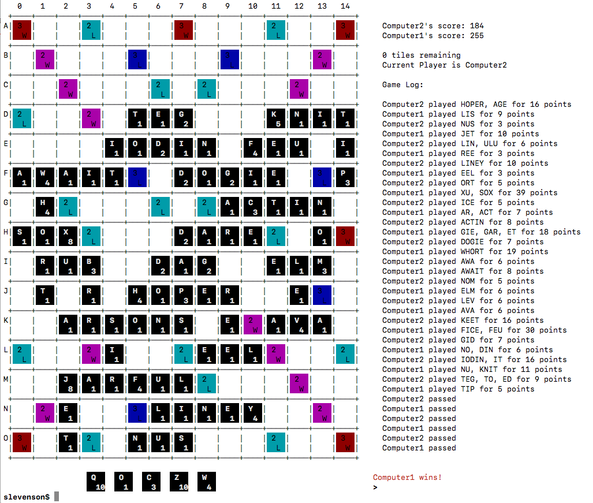

# cs3110 midterm project
- recreation of the board game [scrabble](https://en.wikipedia.org/wiki/Scrabble) in the unix terminal
- written in OCaml using the following packages: [oUnit](https://opam.ocaml.org/packages/ounit2/), [ANSITerminal](https://opam.ocaml.org/packages/ANSITerminal/), [Yojson](https://github.com/ocaml-community/yojson)

screenshot of boardstate after built in AI has played a full game against itself:

